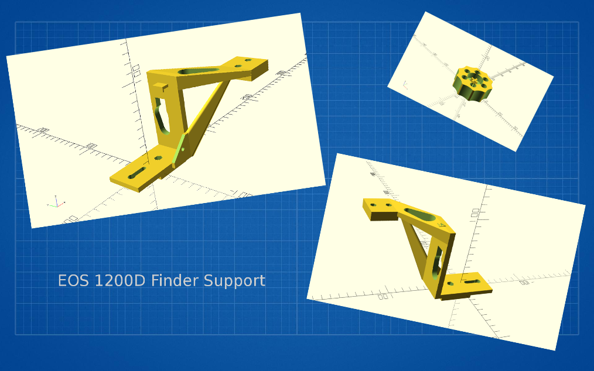
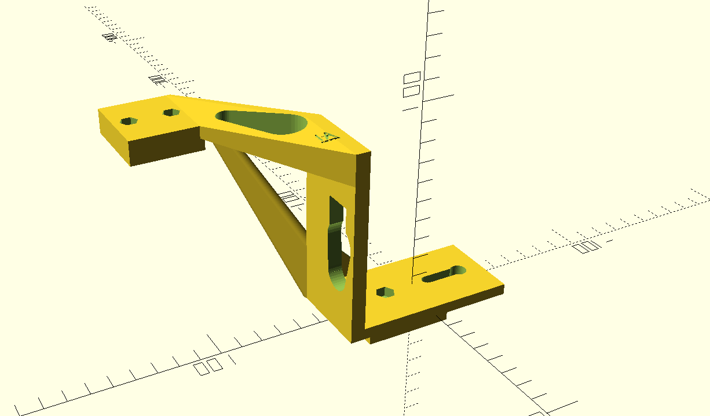
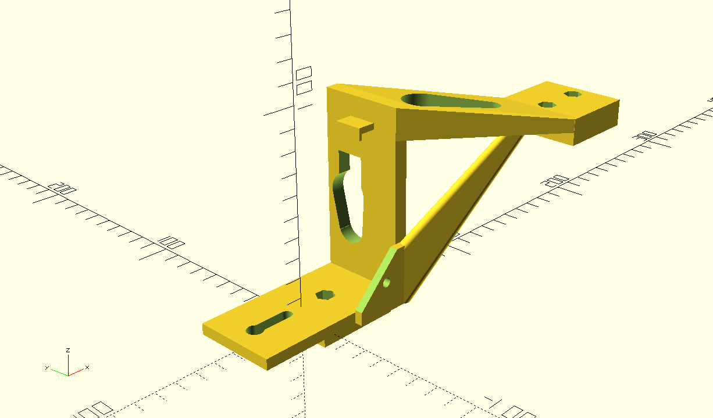
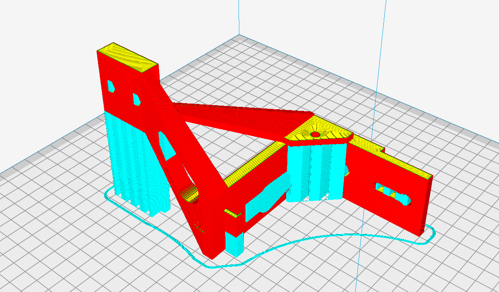

# EOS 1200D Finder Support
Taking some photos of the night sky with a reflex camera only is not easy. The finder is two dark and the livevew allow to see only the really bright stars.

With a short focal it is possible to adjust the orientation but when we want to use a longer one, it become hard to find the object we want.

You will find here an adapter to mount a finder on a EOS 1200D.

Why on the side? 
The finder is placed on the side, because this position is more confortable if we have a 90° finder. With the finder on the flash place, the screen of the camera will be very low. (The EOS 1200 have a fix screen)

The shape is quite complex and to print it some support are required:

The STL files are available here:
- [EOS1200D_Finder_Support.stl](EOS1200D_Finder_Support.stl)
- [ScrewHead.stl](ScrewHead.stl) (optional)
