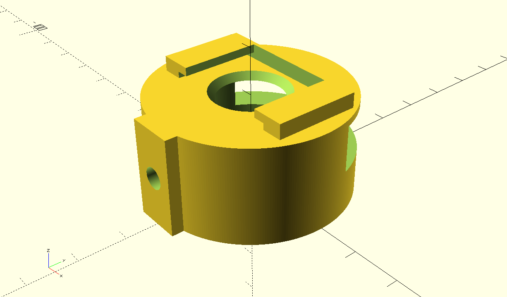
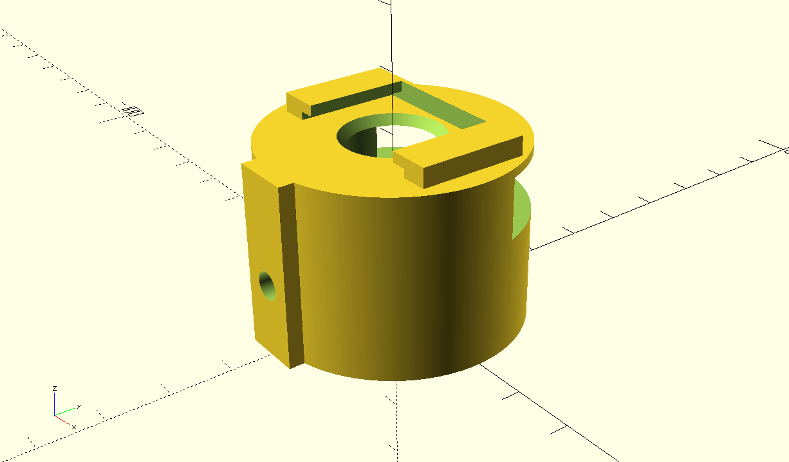
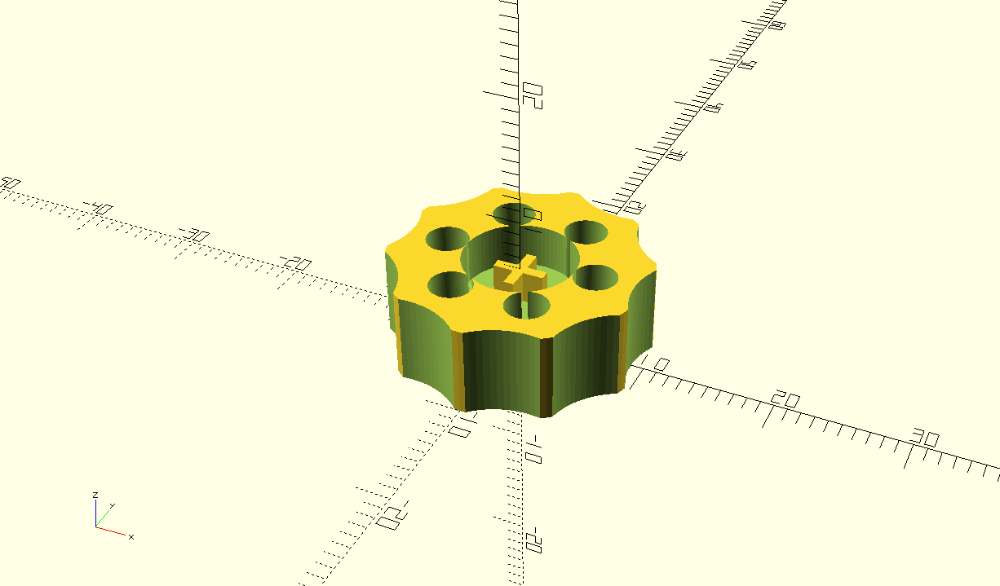
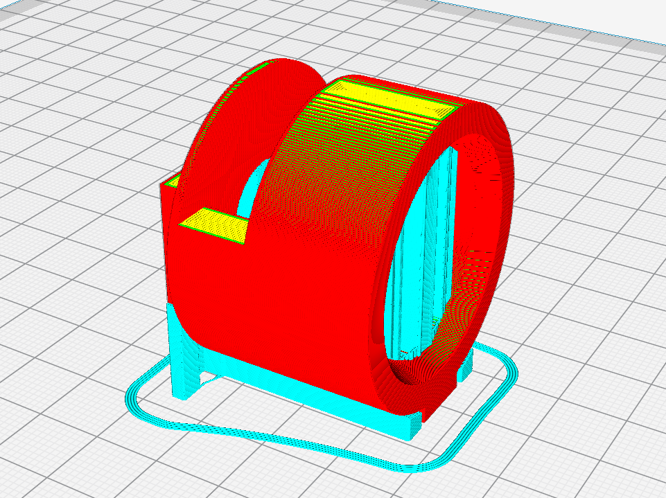

The purpose of this adapter is to mount a canon 90° finder to a polar finder. The ajustement of the mount is very easier, particularly for the people who live quite in north.

Two adapters are provided:
- one for canon 90° finder to a ioptron skytracker polar finder.
- one for canon 90° finder to a Skywatcher EQ6 mount polar finder

The diameter is the same just the length change.

Those adapter are usable on other polar finder.

The short version (works well for Ioptron skytracker)

The long one (works for Skywatcher EQ6 and all mount with equivalent polar finder)

The srew to secure the adapter on the finder is a M5 in plastic. (You have to thread the hole). For a more confortable usage, a cover for the head of the screw is available:

The print the adapter it is recomended to orient it horizontaly. Like that:

This avoid to fill the notch with some support material which is quite hard to remove.

The STL files are available here:
- [Canon_Polar_Adapter.stl](Canon_Polar_Adapter.stl) (Short version)
- [Canon_Polar_Adapter_EQ6.stl](Canon_Polar_Adapter_EQ6.stl) (long version)
- [ScrewHead.stl](ScrewHead.stl) (The screw cover)

All was designed in Openscad. The Openscad files are available on this repository.
